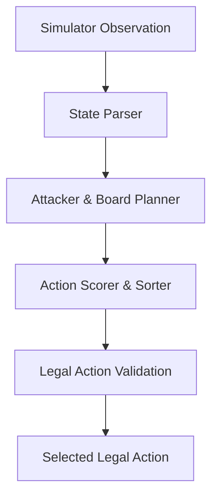

# Agent Architecture & Decision Engine

This document details the software architecture, design patterns, and rule-based planning mechanisms powering the Pokémon TCG AI Battle agents (V11 and V18).

---

## System Overview

Kaggle's Pokémon TCG simulator operates as a turn-based environment where the agent receives an observation dictionary representing the current game state and a list of legal actions. The agent must return one legal action at a time.

Rather than using complex neural network-based Reinforcement Learning (RL) which is prone to timeout violations and memory footprint limits on Kaggle, the agent uses a **deterministic rule-based state-planning system**.



---

## Core Planning Modules

### 1. State Parsing & Representation
*   **Zone Scanning**: Maps active and bench slots for both players, tracking HP, attached energy types, and status effects.
*   **Resource Tracking**: Counts cards remaining in the deck, hand, and discard pile to prevent deck-outs and manage probabilities.
*   **Immunity Detection**: Scans the opponent's active Pokémon and active Stadium to evaluate if they are immune to damage (e.g. *Cornerstone Mask Ogerpon ex* ability or *Neutralization Zone* stadium).

### 2. Attacker and Energy Planner
The planner is designed around the concept of **Attacker Focus**. Instead of spreading energies across multiple Pokémon on the bench, the engine:
*   Identifies the primary active/benched attacker.
*   Calculates the minimum energy requirements to activate the attacker's highest-damage move.
*   Strictly routes energy cards to that primary attacker until they are ready to attack.
*   Prepares a secondary backup attacker line on the bench.

### 3. Action Scoring & Heuristics
When multiple legal actions are available, the agent scores and sorts them:
*   **Attack Selection**: Attacking is a high-priority safety invariant. If a lethal attack is available, it is prioritized.
*   **Draw/Search Supporter Play**: Supporters like *Hilda* or *Lillie's Determination* are scored highly if the hand lacks energy or key evolution lines.
*   **Evolution**: Evolving basic Pokémon (e.g., Dunsparce $\rightarrow$ Dudunsparce, Buneary $\rightarrow$ Lopunny) is prioritized to unlock stronger abilities and attacks.
*   **Tool/Item Attachments**: Tools (like *Air Balloon* to reduce retreat cost) are attached to support basics (Dunsparce/Fan Rotom) to establish free pivoting.

---

## Tactical Innovation Highlight (V18 vs V11)

### One-Prize Stall vs. High-Prize Offense

*   **V11 (One-Prize Crustle/Cornerstone)**: Focuses on denying high-prize knockouts by forcing the opponent to chew through 1-prize defensive Pokémon. Uses *Crustle* to block attacks from *ex* Pokémon and chip away at their HP.
*   **V18 (Mega Lopunny ex)**: Shifts to high-HP (330 HP) sweepers that can deal massive damage for low energy costs. Uses a support loop to cycle cards and heal damage:

```
[Active Dunsparce] --(Draw Cards/Pivot)--> [Active Lopunny ex] --(Attack)
       ^                                         |
       |----------------(Wally Heal Loop)--------|
```

### Advanced V18 Decision Invariants

1.  **Dynamic Damage-Immunity Recognition**:
    If the defending Pokémon has damage immunity (e.g. Cornerstone ability or Neutralization Zone), the agent halts normal attacks and prioritizes attaching the 2nd energy to fire *Spiky Hopper* (which ignores all defensive effects).
2.  **Lethal Bench Gusting (Boss's Orders)**:
    Checks if a benched opponent can be knocked out to secure the final prize cards. If so, drags them to the active spot using Boss's Orders to immediately win.
3.  **Active Support Escape**:
    Basic supports (Dunsparce/Rotom) stuck in the active spot are highly vulnerable. The engine prioritizes retreating them to a ready attacker using *Air Balloon* or single energy attachment rather than stalling.
4.  **Anti-Deckout Guard**:
    Limits the aggressive card drawing of the Dudunsparce engine when the remaining deck size is $\le 2$ to prevent self-defeat.
